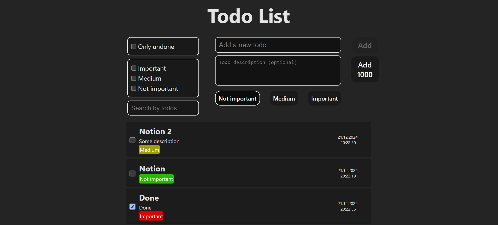

# Todoist



## Description

This project is an advanced Todo List application that offers additional features beyond a standard Todo list. The application includes validation for user inputs, fast rendering capabilities, and minimal re-renders to optimize performance. Users can apply various independent filters and sorting options to manage their tasks efficiently.

## Technologies

-   React: A library for building user interfaces.
-   TailwindCSS: A utility-first CSS framework for rapid UI development.
-   Vite: A modern build tool for fast development of applications.
- CSS modules: One of the modern ways of styling web pages.

## Installation

-   Clone the repository:

    ```bash
    git clone https://github.com/Navi-Friend/todoist
    ```

-   Navigate to the project directory:

    ```bash
    cd todoist
    ```

-   Install the dependencies:
    ```bash
    npm install
    ```
-   Run the application:

    ```bash
    npm run dev
    ```

-   Open your browser

## Features

-   Input Validation: Ensures that user inputs meet specific criteria before adding tasks.
-   Fast Rendering: Optimized for quick display of tasks with minimal loading times.
-   Minimal Re-renders: Efficiently updates the UI without unnecessary re-renders, enhancing performance.
-   Independent Filters: Choose from multiple filters to view tasks based on different criteria (e.g., completed, pending).
-   Sorting Options: Sort tasks by various parameters (e.g., date created, priority).
